<h2>Nutrition</h2>

    

        

            <a title="Le lait : une sacrée vacherie ?" href="https://www.amazon.fr/dp/2877240568/">
                

                    <h3>Le lait : une sacrée vacherie ?</h3>
                    <small>de Nicolas Le Berre (Auteur)</small>
                    

                    <i class="fa fa-plus"></i>
                

                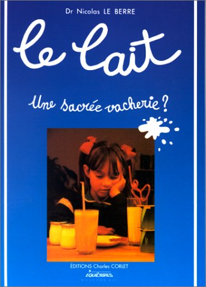
            </a>
        

    

    

        

            <a title="La nutrithérapie : bases scientifiques et pratique médicale" href="https://www.amazon.fr/dp/2857421540/">
                

                    <h3>La nutrithérapie : bases scientifiques et pratique médicale</h3>
                    <small>de Curtay (Auteur)</small>
                    

                    <i class="fa fa-plus"></i>
                

                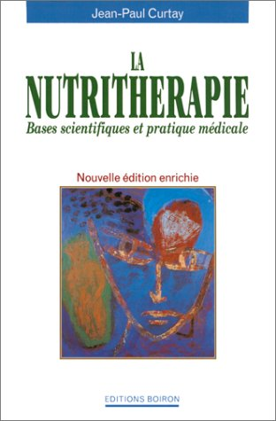
            </a>
        

    

    

        

            <a title="L’Alimentation, ou la troisième médecine" href="https://www.amazon.fr/dp/2868398871/">
                

                    <h3>L’Alimentation, ou la troisième médecine</h3>
                    <small>de Jean Seignalet (Auteur), Henri Joyeux (Préface)</small>
                    

                    <i class="fa fa-plus"></i>
                

                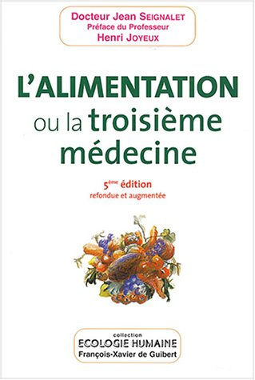
            </a>
        

    

    

        

            <a title="L’index glycémique : un allié pour mieux manger" href="https://www.amazon.fr/dp/2501046676/">
                

                    <h3>L’index glycémique : un allié pour mieux manger</h3>
                    <small>de Jennie Brand-Miller (Auteur), Kaye Foster-Powell (Auteur), Stephen Colagiuri (Auteur), Gérard Slama (Auteur)</small>
                    

                    <i class="fa fa-plus"></i>
                

                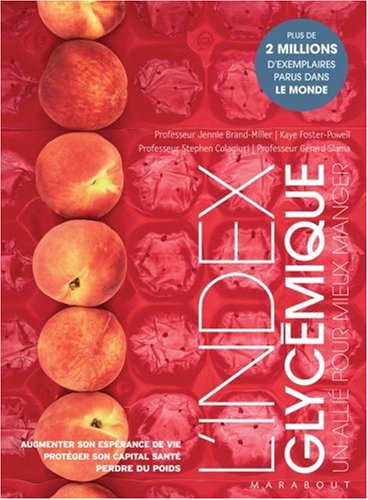
            </a>
        

    

    

        

            <a title="Je mange donc je maigris... et je reste mince !" href="https://www.amazon.fr/dp/2290336335/">
                

                    <h3>Je mange donc je maigris... et je reste mince !</h3>
                    <small>de Michel Montignac (Auteur)</small>
                    

                    <i class="fa fa-plus"></i>
                

                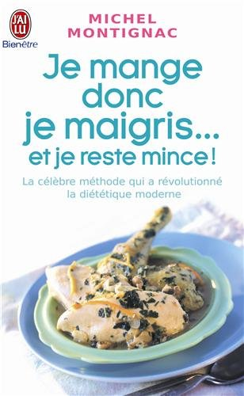
            </a>
        

    

    

        

            <a title="La santé vient en mangeant" href="https://www.amazon.fr/dp/2950902103/">
                

                    <h3>La santé vient en mangeant</h3>
                    <small>de Pierre-Henri Meunier (Auteur)</small>
                    

                    <i class="fa fa-plus"></i>
                

                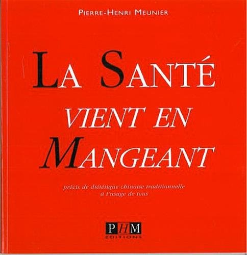
            </a>
        

    

    

        

            <a title="Le régime crétois" href="https://www.amazon.fr/dp/2883431205/">
                

                    <h3>Le régime crétois</h3>
                    <small>de Docteur Jacques Gardan (Auteur)</small>
                    

                    <i class="fa fa-plus"></i>
                

                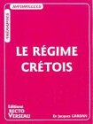
            </a>
        

    

    

        

            <a title="Comment nourrir naturellement son enfant de 0 à 10 ans" href="https://www.amazon.fr/dp/2909757129/">
                

                    <h3>Comment nourrir naturellement son enfant de 0 à 10 ans</h3>
                    <small>de Lionel Clergeaud (Auteur), Chantal Clergeaud (Auteur)</small>
                    

                    <i class="fa fa-plus"></i>
                

                
            </a>
        

    

    

        

            <a title="Pour en finir avec Pasteur : Un siècle de mystification scientifique" href="https://www.amazon.fr/dp/2872110259/">
                

                    <h3>Pour en finir avec Pasteur : Un siècle de mystification scientifique</h3>
                    <small>de Docteur Éric Ancelet (Auteur)</small>
                    

                    <i class="fa fa-plus"></i>
                

                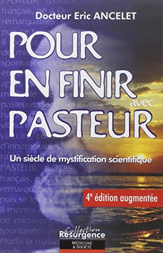
            </a>
        

    

    

        

            <a title="Lait, mensonges et propagande" href="https://www.amazon.fr/dp/2916878149/">
                

                    <h3>Lait, mensonges et propagande</h3>
                    <small>de Thierry Souccar (Auteur)</small>
                    

                    <i class="fa fa-plus"></i>
                

                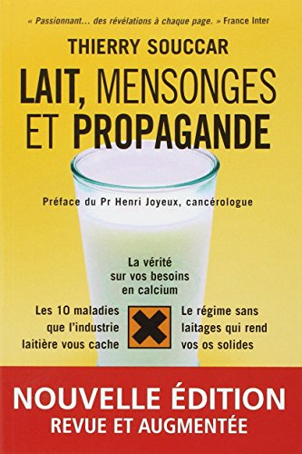
            </a>
        

    

    

        

            <a title="Micronutrition, santé et performance : Comprendre ce qu’est vraiment la micronutrition" href="https://www.amazon.fr/dp/2804152359/">
                

                    <h3>Micronutrition, santé et performance : Comprendre ce qu’est vraiment la micronutrition</h3>
                    <small>de Denis Riché (Auteur), Didier Chos (Auteur)</small>
                    

                    <i class="fa fa-plus"></i>
                

                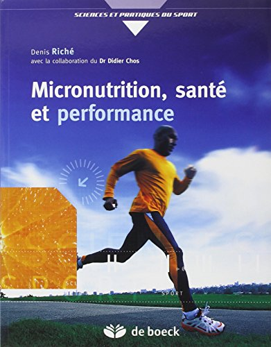
            </a>
        

    

    

        

            <a title="L’énergie du cru : Mettez 75 % de cru dans votre assiette et de la vie dans votre corps !" href="https://www.amazon.fr/dp/2883533210/">
                

                    <h3>L’énergie du cru : Mettez 75 % de cru dans votre assiette et de la vie dans votre corps !</h3>
                    <small>de Leslie Kenton (Auteur), Susannah Kenton (Auteur), Karen Vago (Traduction)</small>
                    

                    <i class="fa fa-plus"></i>
                

                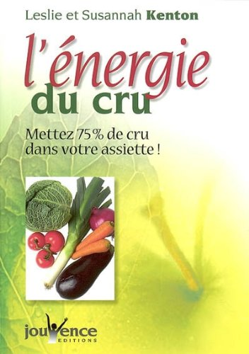
            </a>
        

    

    

        

            <a title="Les incroyables vertus des smoothies verts" href="https://www.amazon.fr/dp/2883539464/">
                

                    <h3>Les incroyables vertus des smoothies verts</h3>
                    <small>de Colette Pairain (Auteur), Nadège Pairain (Auteur)</small>
                    

                    <i class="fa fa-plus"></i>
                

                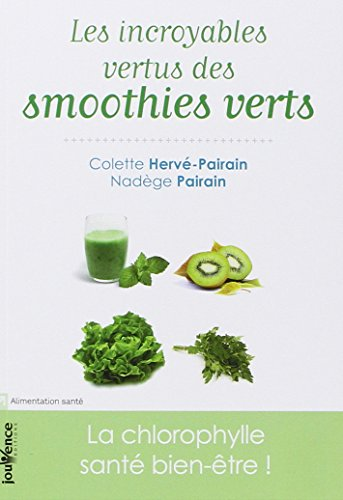
            </a>
        

    

    

        

            <a title="Les aliments contre le cancer : La prévention du cancer par l’alimentation" href="https://www.amazon.fr/dp/2253131504/">
                

                    <h3>Les aliments contre le cancer : La prévention du cancer par l’alimentation</h3>
                    <small>de Richard Beliveau (Auteur)</small>
                    

                    <i class="fa fa-plus"></i>
                

                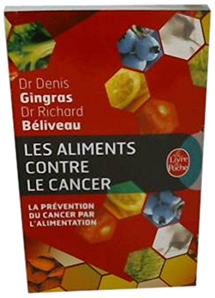
            </a>
        

    

    

        

            <a title="Cholestérol, mensonges et propagande" href="https://www.amazon.fr/dp/2916878173/">
                

                    <h3>Cholestérol, mensonges et propagande</h3>
                    <small>de Michel de Lorgeril (Auteur)</small>
                    

                    <i class="fa fa-plus"></i>
                

                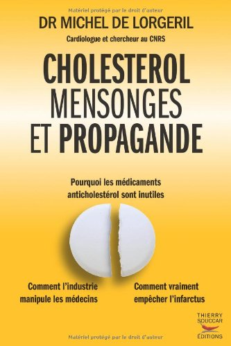
            </a>
        

    

    

        

            <a title="Nutrithérapie : Bases scientifiques et pratique médicale" href="https://www.amazon.fr/dp/2874610526/">
                

                    <h3>Nutrithérapie : Bases scientifiques et pratique médicale</h3>
                    <small>de Jean-Paul Curtay (Auteur)</small>
                    

                    <i class="fa fa-plus"></i>
                

                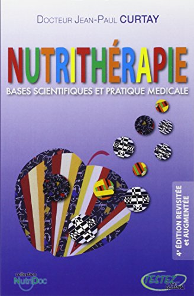
            </a>
        

    

    

        

            <a title="Écosystème intestinal et santé optimale : Nouvelle approche diagnostique et thérapeutique" href="https://www.amazon.fr/dp/287211078X/">
                

                    <h3>Écosystème intestinal et santé optimale : Nouvelle approche diagnostique et thérapeutique</h3>
                    <small>de Georges Mouton (Auteur)</small>
                    

                    <i class="fa fa-plus"></i>
                

                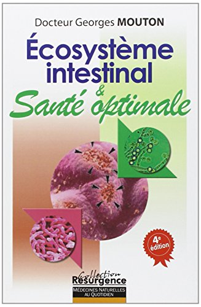
            </a>
        

    

    

        

            <a title="Le régime hormone" href="https://www.amazon.fr/dp/2916878483/">
                

                    <h3>Le régime hormone</h3>
                    <small>de Thierry Hertoghe (Auteur), Margherita Enrico (Auteur)</small>
                    

                    <i class="fa fa-plus"></i>
                

                
            </a>
        

    

    

        

            <a title="Guide familial des aliments soigneurs" href="https://www.amazon.fr/dp/2253085073/">
                

                    <h3>Guide familial des aliments soigneurs</h3>
                    <small>de Jean-Paul Curtay (Docteur) (Auteur)</small>
                    

                    <i class="fa fa-plus"></i>
                

                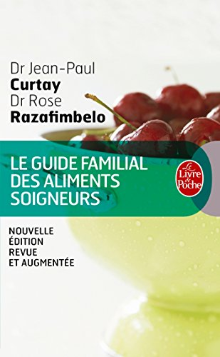
            </a>
        

    

    

        

            <a title="TIME Nutrition “Faites de l’aliment votre médicament”" href="https://www.amazon.fr/dp/2954103205/">
                

                    <h3>TIME Nutrition “Faites de l’aliment votre médicament”</h3>
                    <small>de Jean-René MESTRE (Auteur), Jean-Robert RAPIN (Auteur)</small>
                    

                    <i class="fa fa-plus"></i>
                

                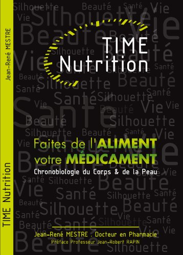
            </a>
        

    

<h2>Phytothérapie &amp; Aromathérapie</h2>

    

        

            <a title="Aromathérapie essentielle : Huiles essentielles et parfums pour le corps et l’âme" href="https://www.amazon.fr/dp/2857079192/">
                

                    <h3>Aromathérapie essentielle : Huiles essentielles et parfums pour le corps et l’âme</h3>
                    <small>de Jean-Louis Abrassart (Auteur)</small>
                    

                    <i class="fa fa-plus"></i>
                

                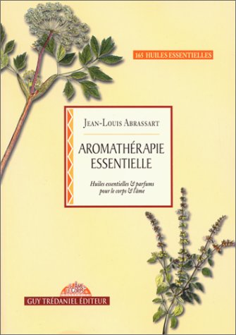
            </a>
        

    

    

        

            <a title="Encyclopédie des plantes médicinales : Identification, préparations, soins" href="https://www.amazon.fr/dp/2035071259/">
                

                    <h3>Encyclopédie des plantes médicinales : Identification, préparations, soins</h3>
                    <small>de Paul Iserin (Préface), Collectif (Auteur)</small>
                    

                    <i class="fa fa-plus"></i>
                

                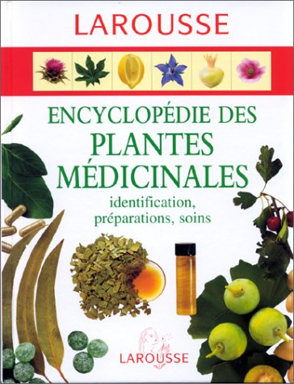
            </a>
        

    

    

        

            <a title="Le guide de l’aromathérapie" href="https://www.amazon.fr/dp/2035822246/">
                

                    <h3>Le guide de l’aromathérapie</h3>
                    <small>de Denise Whichello Brown (Auteur), Marie-Noëlle Pichard (Traduction)</small>
                    

                    <i class="fa fa-plus"></i>
                

                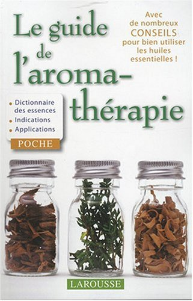
            </a>
        

    

<h2>Thérapies complémentaires</h2>

    

        

            <a title="Homéopathie guide pratique" href="https://www.amazon.fr/dp/284899357X/">
                

                    <h3>Homéopathie guide pratique</h3>
                    <small>de Albert-Claude Quemoun (Auteur)</small>
                    

                    <i class="fa fa-plus"></i>
                

                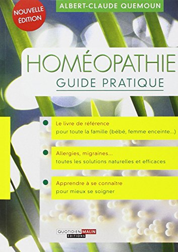
            </a>
        

    

    

        

            <a title="Le grand livre de la naturopathie" href="https://www.amazon.fr/dp/2212548036/">
                

                    <h3>Le grand livre de la naturopathie</h3>
                    <small>de Christian Brun (Auteur)</small>
                    

                    <i class="fa fa-plus"></i>
                

                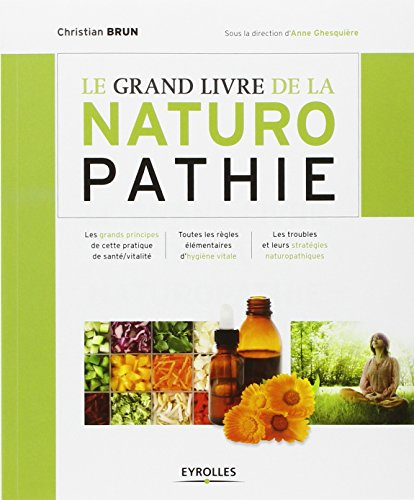
            </a>
        

    

    

        

            <a title="Médecin des trois corps" href="https://www.amazon.fr/dp/2290348279/">
                

                    <h3>Médecin des trois corps</h3>
                    <small>de Janine Fontaine (Auteur)</small>
                    

                    <i class="fa fa-plus"></i>
                

                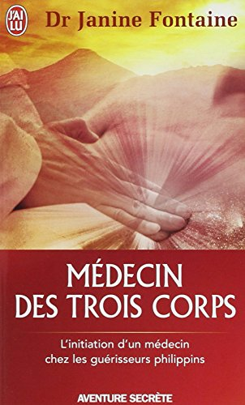
            </a>
        

    

    

        

            <a title="Les 5 piliers de la santé : Au-delà de la Méthode..." href="https://www.amazon.fr/dp/2883530300/">
                

                    <h3>Les 5 piliers de la santé : Au-delà de la Méthode...</h3>
                    <small>de Philippe-Gaston Besson (Auteur), Alain Docteur Bondil (Auteur), André Docteur Denjean (Auteur), Philip Kéros (Auteur)</small>
                    

                    <i class="fa fa-plus"></i>
                

                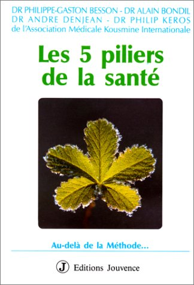
            </a>
        

    

    

        

            <a title="De nombreuses demeures" href="https://www.amazon.fr/dp/2850000051/">
                

                    <h3>De nombreuses demeures</h3>
                    <small>de Gina Cerminara (Auteur)</small>
                    

                    <i class="fa fa-plus"></i>
                

                
            </a>
        

    

    

        

            <a title="Vaccins, mensonges et propagande" href="https://www.amazon.fr/dp/2916878432/">
                

                    <h3>Vaccins, mensonges et propagande</h3>
                    <small>de Sylvie Simon (Auteur)</small>
                    

                    <i class="fa fa-plus"></i>
                

                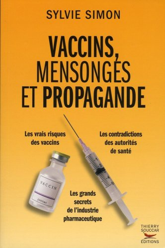
            </a>
        

    

    

        

            <a title="Quand la couleur guérit : Psychologie et chromothératie" href="https://www.amazon.fr/dp/2813200956/">
                

                    <h3>Quand la couleur guérit : Psychologie et chromothératie</h3>
                    <small>de Michèle Delmas (Auteur)</small>
                    

                    <i class="fa fa-plus"></i>
                

                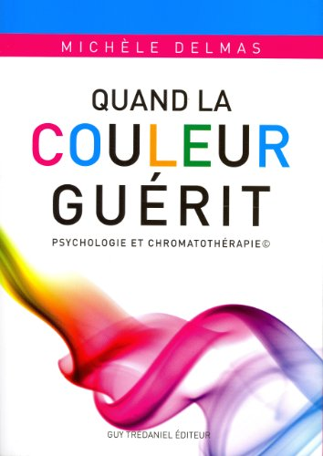
            </a>
        

    

    

        

            <a title="Le massage" href="https://www.amazon.fr/dp/2221048415/">
                

                    <h3>Le massage</h3>
                    <small>de Lucinda Lidell (Auteur)</small>
                    

                    <i class="fa fa-plus"></i>
                

                
            </a>
        

    

    

        

            <a title="Guérir, le stress, l’anxiété, la dépression sans médicament ni psychanalyse" href="https://www.amazon.fr/dp/2221097629/">
                

                    <h3>Guérir, le stress, l’anxiété, la dépression sans médicament ni psychanalyse</h3>
                    <small>de David Servan-Schreiber (Auteur)</small>
                    

                    <i class="fa fa-plus"></i>
                

                
            </a>
        

    

    

        

            <a title="Psycho-neuro immunologie" href="https://www.amazon.fr/dp/2872110291/">
                

                    <h3>Psycho-neuro immunologie</h3>
                    <small>de Francesco Bottaccioli (Auteur)</small>
                    

                    <i class="fa fa-plus"></i>
                

                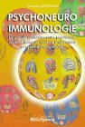
            </a>
        

    

    

        

            <a title="L’adrénaline : Trop c’est trop ! Le syndrome du stress du 21e siècle" href="https://www.amazon.fr/dp/2922969045/">
                

                    <h3>L’adrénaline : Trop c’est trop ! Le syndrome du stress du 21e siècle</h3>
                    <small>de James Wilson (Auteur), Collectif (Auteur), Jonathan V. Wright (Préface)</small>
                    

                    <i class="fa fa-plus"></i>
                

                
            </a>
        

    

<h2>Développement personnel</h2>

    

        

            <a title="La Divine Matrice" href="https://www.amazon.fr/dp/2896260307/">
                

                    <h3>La Divine Matrice</h3>
                    <small>de Gregg Braden (Auteur)</small>
                    

                    <i class="fa fa-plus"></i>
                

                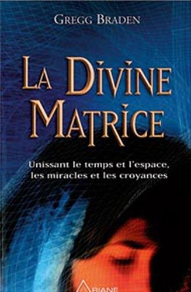
            </a>
        

    

    

        

            <a title="La liberté d’être ou la voie de la plénitude" href="https://www.amazon.fr/dp/2980084352/">
                

                    <h3>La liberté d’être ou la voie de la plénitude</h3>
                    <small>de Annie Marquier (Auteur)</small>
                    

                    <i class="fa fa-plus"></i>
                

                
            </a>
        

    

    

        

            <a title="Racines familiales de la “mal a dit”" href="https://www.amazon.fr/dp/2951846304/">
                

                    <h3>Racines familiales de la “mal a dit”</h3>
                    <small>de Gérard Athias (Auteur)</small>
                    

                    <i class="fa fa-plus"></i>
                

                
            </a>
        

    

    

        

            <a title="La suite... Racines familiales de la “mal a dit”" href="https://www.amazon.fr/dp/2951846312/">
                

                    <h3>La suite... Racines familiales de la “mal a dit”</h3>
                    <small>de Gérard Athias (Auteur)</small>
                    

                    <i class="fa fa-plus"></i>
                

                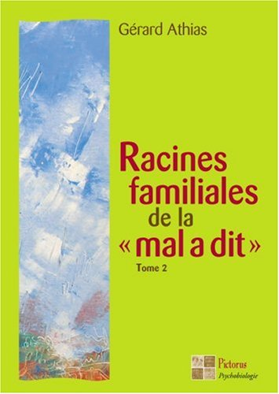
            </a>
        

    

    

        

            <a title="L’audace de vivre" href="https://www.amazon.fr/dp/271030385X/">
                

                    <h3>L’audace de vivre</h3>
                    <small>de Véronique Loiseleur (Auteur), Arnaud Desjardins (Auteur)</small>
                    

                    <i class="fa fa-plus"></i>
                

                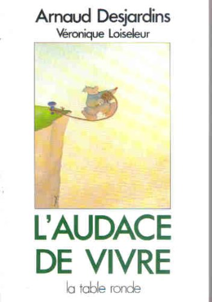
            </a>
        

    

    

        

            <a title="La puissance de votre subconscient" href="https://www.amazon.fr/dp/2826700286/">
                

                    <h3>La puissance de votre subconscient</h3>
                    <small>de MURPHY Joseph Dr (Auteur)</small>
                    

                    <i class="fa fa-plus"></i>
                

                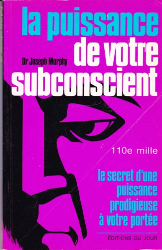
            </a>
        

    

    

        

            <a title="L’éveil de votre puissance intérieure" href="https://www.amazon.fr/dp/2890444864/">
                

                    <h3>L’éveil de votre puissance intérieure</h3>
                    <small>de Anthony Robbins (Auteur)</small>
                    

                    <i class="fa fa-plus"></i>
                

                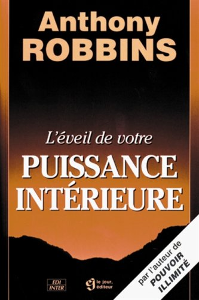
            </a>
        

    

    

        

            <a title="Les cinq blessures qui empêchent d’être soi-même" href="https://www.amazon.fr/dp/2920932187/">
                

                    <h3>Les cinq blessures qui empêchent d’être soi-même</h3>
                    <small>de Lise Bourbeau (Auteur)</small>
                    

                    <i class="fa fa-plus"></i>
                

                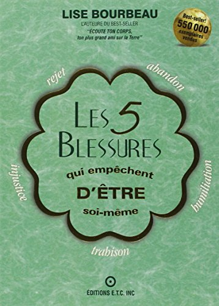
            </a>
        

    

    

        

            <a title="Le grand livre de la vie" href="https://www.amazon.fr/dp/2970063883/">
                

                    <h3>Le grand livre de la vie</h3>
                    <small>de Stéphane Bruchez (Auteur)</small>
                    

                    <i class="fa fa-plus"></i>
                

                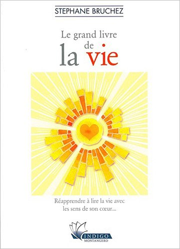
            </a>
        

    

    

        

            <a title="Ouvriers du ciel (les) - au-delà des apparences" href="https://www.amazon.fr/dp/2970063816/">
                

                    <h3>Ouvriers du ciel (les) - au-delà des apparences</h3>
                    <small>de Stéphane Bruchez (Auteur)</small>
                    

                    <i class="fa fa-plus"></i>
                

                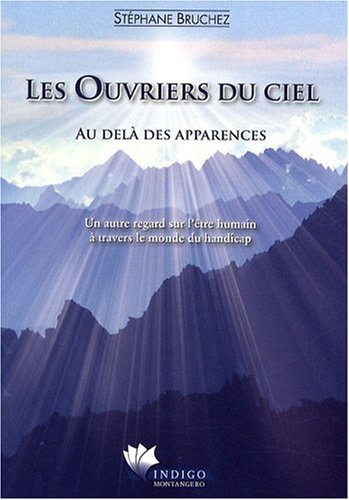
            </a>
        

    

    

        

            <a title="Le livre tibétain de la vie et de la mort" href="https://www.amazon.fr/dp/2710305933/">
                

                    <h3>Le livre tibétain de la vie et de la mort</h3>
                    <small>de Dalaï-Lama (Préface), Sogyal Rinpoché (Auteur)</small>
                    

                    <i class="fa fa-plus"></i>
                

                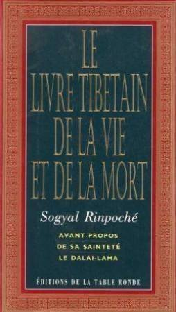
            </a>
        

    

    

        

            <a title="Les 3 émotions qui guérissent" href="https://www.amazon.fr/dp/2916878874/">
                

                    <h3>Les 3 émotions qui guérissent</h3>
                    <small>de Emmanuel Pascal (Auteur), David O’Hare (Préface)</small>
                    

                    <i class="fa fa-plus"></i>
                

                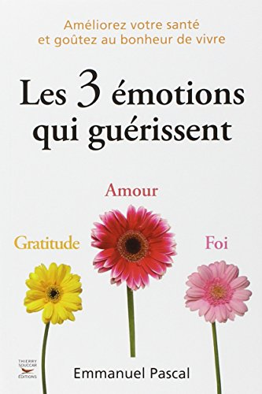
            </a>
        

    

<h2>Philosophie</h2>

    

        

            <a title="Le Sacrifice interdit : Freud et la Bible" href="https://www.amazon.fr/dp/2253942200/">
                

                    <h3>Le Sacrifice interdit : Freud et la Bible</h3>
                    <small>de Marie Balmary (Auteur)</small>
                    

                    <i class="fa fa-plus"></i>
                

                
            </a>
        

    

