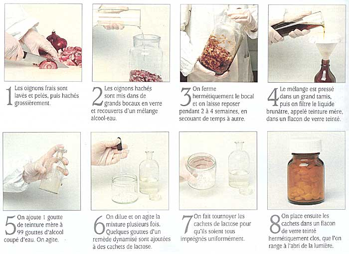
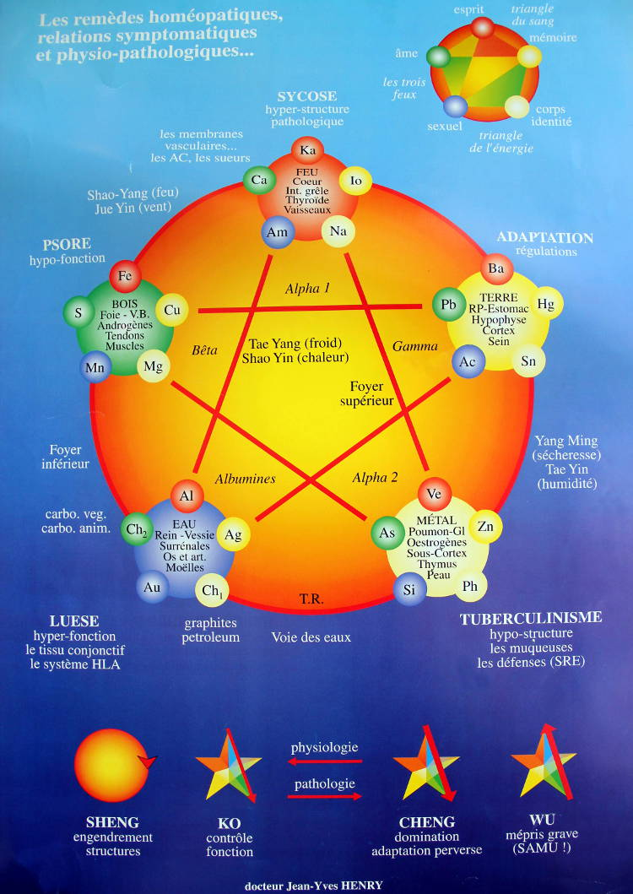

L’homéopathie est une médecine à fondements scientifiques, pratiquée par des spécialistes. Selon le Dr Samuel HAHNNEMANN (1755 — 1843), qui a passé sa vie à la mettre en valeur, l’homéopathie est basée sur le principe de similitude :

> Toute substance médicamenteuse capable, à certaine dose, de déterminer des troubles pathologiques dans un organisme sain, peut, à autre dose, guérir des troubles analogues chez un individu malade.

Exemple : BELLADONNA — action dans un organisme sain : violente congestion active de tous les centres nerveux — action homéopathique : action sur les congestions fébriles avec rougeurs et sécheresses, céphalées et hallucinations…

Plus la substance est diluée, infinitésimale, plus elle est active. Cette conception heurte souvent les esprits, car on se demande comment des dilutions extrêmement diluées peuvent agir. Certains prétendent qu’il n’y a plus rien dans le médicament homéopathique ! C’est oublier que l’infinitésimal n’agit que dans la mesure où le médicament a été correctement choisi selon principe de similitude.

## Qu’est-ce qu’un médicament homéopathique ?

Ils sont obtenus à partir de substances provenant des trois règnes de la nature :

-   Minéral, par ex. Aurum metallicum (l’or)
-   Végétal, par ex. Arnica
-   Animal, par ex. Apis mellifica (l’abeille)

## Préparations homéopathiques

Il existe deux procédures principales de préparations des dynamisations : les dynamisations Hahnemanniennes d’une part et les dynamisations Korsakoviennes d’autre part. Les dynamisations Hahnemanniennes sont des dilutions réalisées de dixième en dixième (selon la pharmacopée homéopathique allemande) ou de centième en centième (selon la pharmacopée homéopathique française). On utilise un flacon différent pour réaliser chaque dilution. Les dynamisations Korsakoviennes se font toutes dans le même flacon (excepté au début et à la fin de l’opération). Le médecin russe Korsakov travaillait sur des champs de bataille et a simplifié la méthode dite Hahnemannienne pour pouvoir soigner un maximum de gens avec un minimum de flacons et en un minimum de temps. Samuel Hahnemann lui-même fut mis au courant de la méthode de Korsakov, la testa et écrivit qu’elle était aussi efficace que sa propre technique de dynamisation. L’Histoire de l’homéopathie est remplie de nombreux autres pionniers, Kent lui-même préparait ses remèdes autrement. À partir de 1920 les différentes écoles ont dû choisir pour que les prescriptions soient reproductibles et compatibles dans leurs effets. Les deux principales qui sont restées ont toutefois des passerelles dans leurs applications. Il faut cependant respecter la prescription du thérapeute surtout pour les traitements unicistes (qui n’utilisent qu’un seul remède à la fois).

## Les équivalences thérapeutiques les plus souvent admises

|     dilution     | dilution D | dilution CH | dilution K |
| :--------------: | :--------: | :---------: | :--------: |
| 10-1  |     1D     |             |            |
| 10-2  |     2D     |     1CH     |            |
| 10-3  |     3D     |             |            |
| 10-4  |     4D     |     2CH     |            |
| 10-5  |     5D     |             |            |
| 10-6  |     6D     |     3CH     |     3K     |
| 10-7  |     7D     |             |            |
| 10-8  |     8D     |     4CH     |     6K     |
| 10-9  |     9D     |             |            |
| 10-10 |    10D     |     5CH     |    30K     |
| 10-12 |            |     6CH     |    100K    |
| 10-14 |            |     7CH     |    200K    |
| 10-16 |            |     8CH     |            |
| 10-18 |            |     9CH     |     MK     |
| 10-24 |            |    12CH     |    VMK     |
| 10-30 |            |    15CH     |    XMK     |
| 10-40 |            |    20CH     |            |
| 10-44 |            |    22CH     |    LMK     |
| 10-60 |            |    30CH     |    CMK     |

## Limite de la matière

Le nombre d’Avogadro, 6.022×1023 mol-1, donne les limites de la dilution, c’est-à-dire qu’entre 10-23 et 10-24, entre 11 et 12 CH, il n’y a plus d’atomes de la souche de départ, on entre ici dans le domaine de l’information et de l’énergétique.

